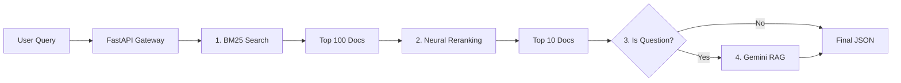

# Portuguese Wikipedia Search & RAG Engine

A retrieval system built from scratch for the **Portuguese Wikipedia (2.7M articles)**. The system features a memory-optimized **SPIMI indexer** (running under strict 2GB RAM constraints) and a **Hybrid Search** pipeline that combines lexical retrieval with semantic reranking and Generative AI (RAG).

**What does this engine do?**
1.  **Ingests Massive Data:** It processes raw Wikipedia dumps (`.arrow` or `.jsonl`) using a custom **SPIMI (Single-Pass In-Memory Indexing)** algorithm, managing memory manually to prevent crashes on consumer hardware.
2.  **Understands Queries:** It combines **BM25 lexical search** (finding exact keyword matches) with **Neural Reranking** (using Cross-Encoders to understand semantic meaning), ensuring the most relevant results float to the top.
3.  **Answers Questions (RAG):** Instead of just giving you links, the system uses a **Retrieval-Augmented Generation** pipeline. It feeds the best search results into Google's **Gemini AI**, which reads the context and answers user questions naturally (e.g., *"Who discovered Brazil?"*) without hallucinations.

---

## Key Features

### 1. Memory-Constrained Indexing (SPIMI)
Built to process massive datasets on consumer hardware:
- **Custom SPIMI Implementation:** Processes the 2.7M article dump using Single-Pass In-Memory Indexing.
- **Resource Monitor:** A background daemon (`MemoryGuard`) actively monitors RSS usage and forces disk flushes if RAM usage exceeds **2GB**, preventing OOM crashes.
- **Binary Offset Indexing:** Optimizes retrieval speed by using a lightweight offset lookup table instead of loading the full inverted index into memory.

### 2. Hybrid Retrieval Pipeline
- **Lexical Search (Stage 1):** BM25 algorithm implemented with optimized sparse matrix operations for initial candidate retrieval (Top-100).
- **Neural Reranking (Stage 2):** Uses a Cross-Encoder (`mmarco-mMiniLMv2-L12-H384-v1`) to semantically re-rank documents, significantly improving precision for natural language queries.
- **Smart Snippet Extraction:** Instead of passing full documents to the LLM, the system identifies and extracts the single most relevant paragraph.

### 3. RAG Agent (Gemini API)
Integrates Google's **Gemini 2.5 Flash** to provide grounded answers:
- **Query Intent Classification:** Detects if the user input is a specific question or a broad keyword search.
- **Hallucination Reduction:** Answers are strictly grounded in the retrieved Wikipedia context.
- **Query Expansion:** Automatically suggests improved queries for misspelled or ambiguous terms (e.g., *"stats cr7"* → *"Estatísticas de Cristiano Ronaldo"*).

---

## Architecture



## Installation & Setup

This project uses `uv` for modern, fast Python dependency management.

### 1. Clone the repository
```bash
git clone [https://github.com/patricijamarijanovic/search-engine.git](https://github.com/patricijamarijanovic/search-engine.git)
cd search-engine
```

### 2. Install Dependencies
```bash
uv sync
```

### 3. Configure Environment
The system requires a Google Gemini API key for the AI features.

1. Copy the example config:
   ```bash
   cp .env.example .env
   ```

2. Open `.env` and paste your key (Get one at [Google AI Studio](https://aistudio.google.com/)):
   ```bash
   GEMINI_API_KEY=your_actual_api_key_here
   ```

## Data 

Due to the size of the full index (~6GB), the artifacts are not hosted directly on GitHub.

1. Download the index artifacts from: **[www.kaggle.com/datasets/patricijamarijanovi/search-index]**
2. Extract the files (`final_index.jsonl`, `forward_index.db`, etc.) into the `output/` directory in the project root.

## Usage

### Start the Search API
Run the FastAPI server with hot-reloading:

```bash
uv run uvicorn sapien.entrypoints.asgi:app --reload
```

### Accessing the Interface

Once the server is running, you can interact with the search engine:
   Open **[http://127.0.0.1:8000](http://127.0.0.1:8000)** in your browser.
   This is the main interface where you can type queries and view results with the AI-generated answer at the top.
